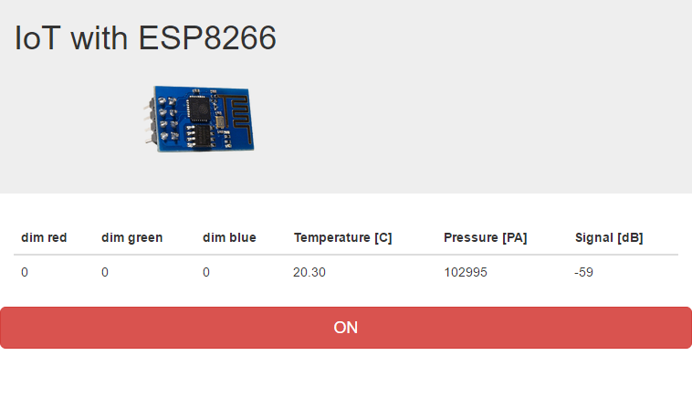

# IoT With ESP8266
This Project realized an example how to connect to a Webservice running on the ESP8266 with a temperature / pressure Sensor, the BMP180 and an RGB LED

[](https://www.youtube.com/watch?v=_6Ki8T2blc0)

### Wirering


### Screenshots
#### web pages


#### .NET Powershell Client

### Diagrams
#### structure chart

#### ER diagram

#### use case diagram

#### activity diagram

#### sequence diagram

#### state machine

### Features
  - Webservice JSON,XML,JSONP
  - Embedded Webserver
  - HTML5 Client
  - .Net Client in Powershell
  - logging into a google spreadsheet

### WebApi


### Powershell Examples

**Get the current Sensor Data**
```sh
Invoke-RestMethod http://service.joerg-tuttas.de:8266/json
```
**Dim red LED to 50%**
```sh
Invoke-RestMethod http://service.joerg-tuttas.de:8266/json/dim/r=512/
```
**Dim red LED to 10%,green LED to 50% and blue LED to 100%**
```sh
Invoke-RestMethod http://service.joerg-tuttas.de:8266/json/dim/r=102/g=512/b=1023/
```
**Get Sensor Data as XML**
```sh
Invoke-RestMethod http://service.joerg-tuttas.de:8266/xml
```
**Get Sensor Data from Google Spreadsheet**
```sh
Invoke-RestMethod -Uri https://script.google.com/macros/s/AKfycbzJqwSzEzhEhr9KIRHGrhXSypd-5MbWLsigN4BUvg-ivvq9GPsq/exec?mac=5c:cf:7f:d0:1f:21:
```

### used Ressources
- Websocket implementation by [Markus Sattler]
- library for the Adafruit [BMP085/BMP180] Barometric Pressure + Temp sensor

### Examples

- Take a look at the [html5] client
- ESP8266 [Webserver] page
- Get sensor data as [json]
- Get Sensor data as [xml]

   [html5]: <http://htmlpreview.github.io/?https://github.com/jtuttas/ESP8266/blob/final/public_html/index.html>
   [Webserver]: <http://service.joerg-tuttas.de:8266/index.html>
   [json]: <http://service.joerg-tuttas.de:8266/json>
   [xml]: <http://service.joerg-tuttas.de:8266/xml>
   [Markus Sattler]: <https://github.com/Links2004/arduinoWebSockets>
   [BMP085/BMP180]: <https://github.com/adafruit/Adafruit-BMP085-Library>
